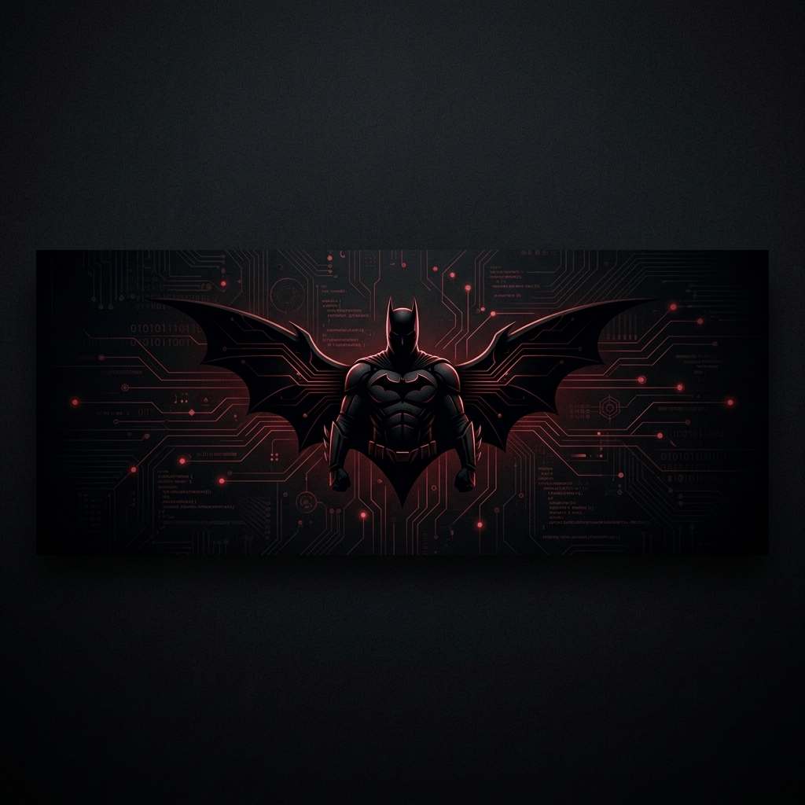

# 🦇 PIYUSH VATS
### Full-Stack Developer | Building Cinematic Web Experiences

---

"I don't just write code; I craft digital narratives."

[Portfolio](https://piyushvats.vercel.app/) • [LinkedIn](https://www.linkedin.com/in/p1yush-vats/) • [Twitter](https://twitter.com/p1yush_vats)

## 🌌 About Me
I'm a developer pursuing **BCA**, deeply passionate about creating immersive, high-performance web applications. My work blends cinematic aesthetics with robust engineering, focusing on user experience and visual storytelling.

- 🛠️ Currently building **Sentinel** & **Cinematic Portfolio**.
- 🚀 Exploring the intersection of **3D Web (Three.js)** and **Modern Frontend**.
- 🦇 Aesthetic: **Crescent Red** | Minimalist | Dark Mode Enthusiast.

## 💻 Tech Stack

| Category | Tools & Technologies |
| :--- | :--- |
| **Frontend** |     |
| **Animations** |    |
| **Backend** |    |
| **Design** |   |

## 📊 GitHub Stats

## 🏆 Featured Projects

### 🔉 [Sonar](https://github.com/p1yush-vats/Sonar)
*AI-powered music recognition system inspired by Shazam.*
- **Tech**: Python, React, Audio processing.

### 🛡️ [Sentinel](https://github.com/p1yush-vats/Sentinel)
*Work integrity and monitoring system.*
- **Tech**: Next.js, Electron, Real-time tracking.

### 🎨 [Cinematic Portfolio](https://github.com/p1yush-vats/Portfolio)
*High-end visual showcase with 3D components.*
- **Tech**: Three.js, GSAP, Framer Motion.

---

**[Let's Connect!](https://www.linkedin.com/in/p1yush-vats/)**

